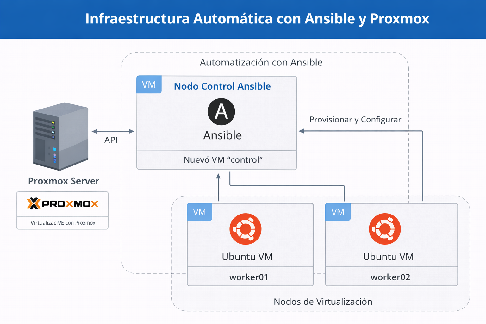

# ⚙️ Automatización con Ansible en Proxmox VE

## 📖 Descripción General

This project demonstrates how to automate virtual machine provisioning and configuration in Proxmox VE using Ansible.

---

## 🧱 Arquitectura

* 1x Proxmox VE Host
* 1x Ansible Control Node
* Multiple Target VMs (Ubuntu Server)
* SSH-based communication
* Proxmox API Token authentication



> Diagrama de automatización usando Ansible y Proxmox VE.
---

## ⚙️ Requisitos

* Proxmox VE 7 or later
* Ubuntu Server template with Cloud-Init
* Ansible 2.12+
* Python3 and pip
* Proxmox API Token
* SSH access enabled on target VMs

---

## 🚀 Paso 1: Instalar Ansible

On the control node:

```bash
sudo apt update
sudo apt install -y ansible python3-pip
pip install proxmoxer
```

Verify installation:

```bash
ansible --version
```

---

## 🔐 Paso 2: Configurar Acceso a Proxmox API

Create an API token in Proxmox:

Datacenter → Permissions → API Tokens

Store credentials securely (use Ansible Vault in production).

---

## 📂 Paso 3: Crear Inventario

Create an inventory file `inventory.ini`:

```ini
[proxmox]
pve-node ansible_host=192.168.1.10

[targets]
vm1 ansible_host=192.168.1.101
vm2 ansible_host=192.168.1.102
```

Test connectivity:

```bash
ansible all -m ping -i inventory.ini
```

---

## 🖥️ Paso 4: Crear VM en Proxmox con Ansible

Example playbook `create-vm.yml`:

```yaml
- name: Create VM in Proxmox
  hosts: proxmox
  gather_facts: false
  tasks:
    - name: Clone VM from template
      community.general.proxmox_kvm:
        api_user: ansible@pve
        api_token_id: ansible
        api_token_secret: YOUR_TOKEN_SECRET
        api_host: "{{ ansible_host }}"
        node: pve
        clone: ubuntu-template
        vmid: 300
        name: ansible-vm01
        cores: 2
        memory: 2048
        net:
          net0: virtio,bridge=vmbr0
        state: present
```

Run the playbook:

```bash
ansible-playbook -i inventory.ini create-vm.yml
```

---

## 🛠️ Paso 5: Configurar Servidores Objetivo

Example configuration playbook:

```yaml
- name: Configure Docker on target nodes
  hosts: targets
  become: true
  tasks:
    - name: Install Docker
      apt:
        name: docker.io
        state: present
        update_cache: yes

    - name: Enable Docker service
      systemd:
        name: docker
        enabled: yes
        state: started
```

---

## 🔒 Manejo de Secretos con Ansible Vault

Encrypt sensitive data:

```bash
ansible-vault encrypt secrets.yml
```

Run playbook with vault:

```bash
ansible-playbook create-vm.yml --ask-vault-pass
```

---

## 📦 Estructura Recomendada del Proyecto

```
ansible-proxmox/
│
├── inventory.ini
├── create-vm.yml
├── configure-docker.yml
├── group_vars/
├── host_vars/
└── roles/
```
---

## 🧑‍💻 Autor

Jonas Carrillo Carballo

Cloud & Infrastructure Engineer

---
